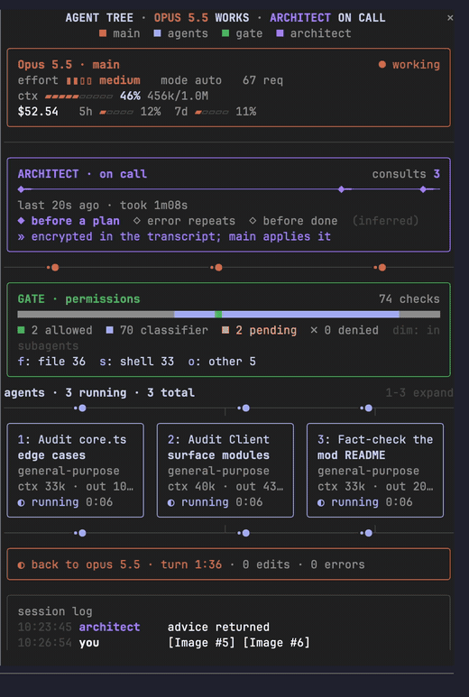
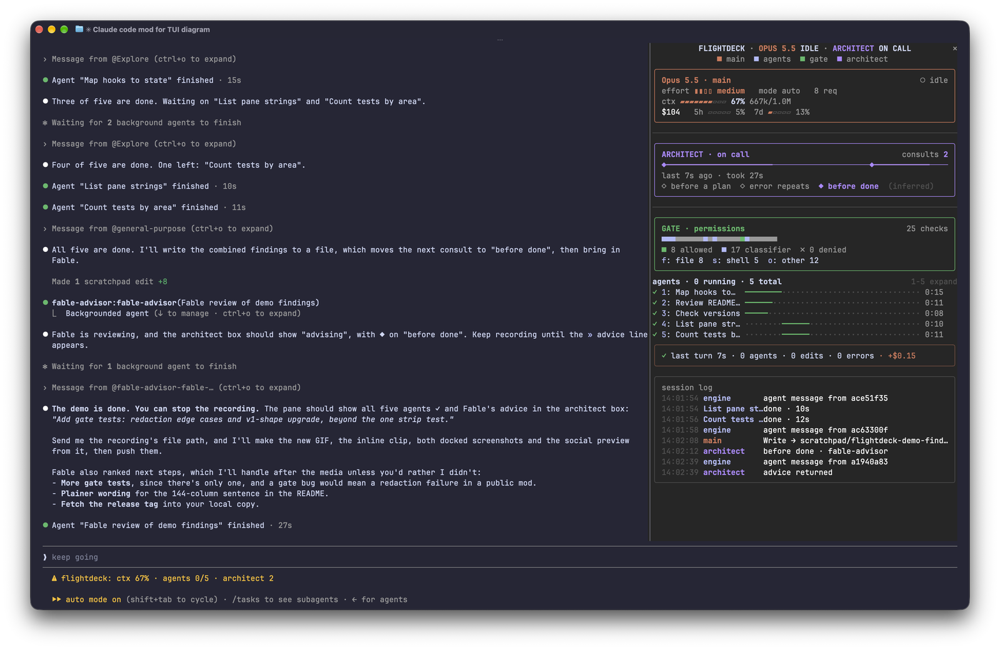
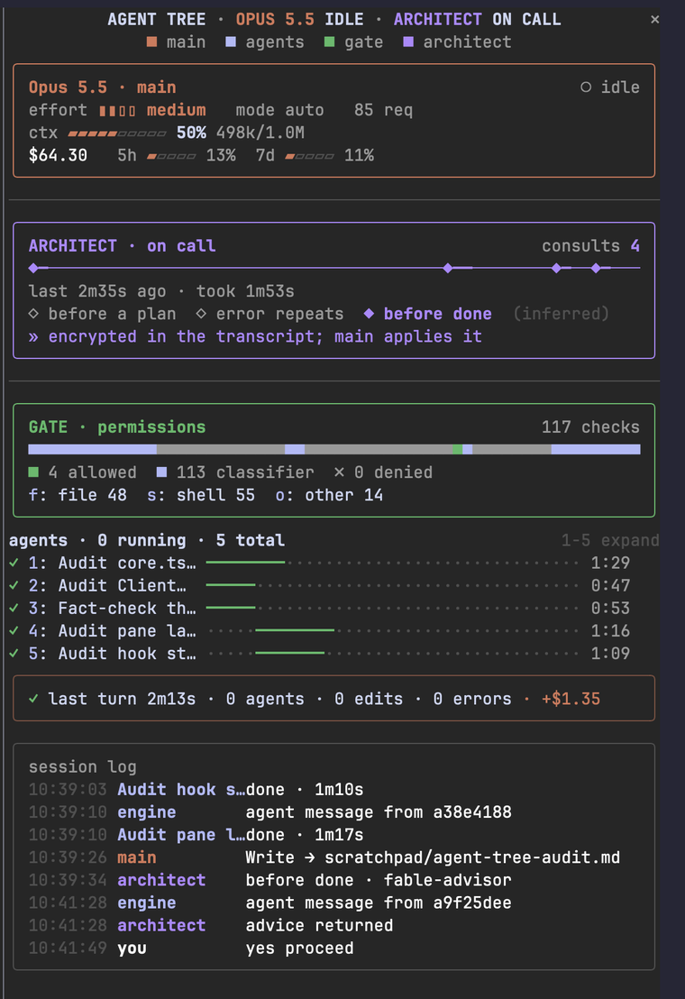
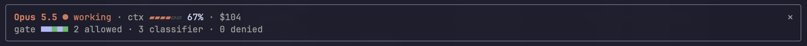

# Liveroom

[](LICENSE)
[](https://claude.com/blog/claude-code-mods)

**A Claude Code mod that puts a live room in your terminal**: context and cost, an advisor timeline, every permission check, and your subagents as cards or swimlanes. Every number comes from a real session event, and nothing leaves your machine.

> Liveroom is a fork of [Flightdeck](https://github.com/scasella/claude-flightdeck) by Stephen Casella, used under the MIT License. On top of Flightdeck 0.3.2 it adds the **models**, **codex** and **skills** panels and a ⚠ for subagents that silently inherit the main model; the screenshots below are still Flightdeck's. Coming next: an agent-team room and a Turkish UI option.

<p align="center">
  
</p>

<p align="center">
  <a href="#install">Install</a> · <a href="#what-you-see">What you see</a> · <a href="#what-it-can-reach">What it can reach</a> · <a href="#configure">Configure</a> · <a href="#troubleshooting">Troubleshooting</a>
</p>

## Install

Inside Claude Code (2.1.287 or later):

```
/plugin marketplace add chelebyy/claude-liveroom
/plugin install liveroom@claude-liveroom
/reload-plugins
/liveroom
```

<details>
<summary><strong>From the terminal, or from a clone</strong></summary>

```sh
claude plugin marketplace add chelebyy/claude-liveroom
claude plugin install liveroom@claude-liveroom
```

Or load it straight from a clone, for one session:

```sh
git clone https://github.com/chelebyy/claude-liveroom
claude --plugin-dir ./claude-liveroom
```

</details>

The installer may say config options aren't set; the defaults are fine, and [`/config`](#configure) changes them.

Mods are an early-access Claude Code feature and their API can change between releases. If something breaks, see [Troubleshooting](#troubleshooting).

## What you see

https://github.com/user-attachments/assets/9ad0fcc3-c81c-427a-a743-f7b6c49f5885

<p align="center">
  
</p>

| Docked beside the transcript | Inline above the prompt |
| --- | --- |
|  | <br><br>On the main screen, without fullscreen, the pane is a summary of at most 8 rows; up to 3 agents join it when the session has subagents. |

| Panel | Shows | From |
| --- | --- | --- |
| **main** | model, effort, permission mode, request count; a context gauge with compactions (⟲); cost and the first two rate-limit windows when your plan reports them | `turn.step`, `session.measure`, `session.compact`, `$.session.usage()` |
| **models** | requests per model and effort across the main loop and every subagent, ranked | `turn.step` |
| **architect** | consults on a timeline, whether one is running, how long the last took; optionally the moment of each consult; the first line of a subagent architect's advice | a spawn of a matching agent type, or a matching server tool in the assistant's rows |
| **gate** | one cell per permission check: green allowed without asking, blue decided by the auto-mode classifier or you and then run, amber pending, red ✗ denied, dim if made inside a subagent. Totals, and a drill-down per tool family with credentials masked | `tool.check`, settled by the `tool.call` around it |
| **agents** | cards side by side while they fit: the task, type, live context and output tokens, steps, a running clock, `max_tokens` in red. Beyond that, swimlanes on one time axis | `agent.spawn`, `turn.step`, `tool.call`, `turn.complete` |
| **codex** | work handed to Codex, through the `codex:codex-rescue` agent or `codex exec` / `codex review` in the shell: kind (rescue, consult, exec, review), model, effort, a running clock and the same status colours as the cards (◐ running, ✓ done, ✗ failed), ◌ bg for one sent off with `&`, and ■ for one that ended without a verdict; ⚠ when a hand-off names no model or effort | `tool.call` on `Agent` and `Bash`, background task notifications |
| **loops** | model loops that match no card: workflow agents, compactions, memory forks | `turn.step` ids no card claims |
| **skills** | skills called, and plugins used through their skills, agent types and MCP tools | `tool.call` |
| **receipt** | the running turn, or the last one: duration, agents, edits, errors, cost added | `turn.start`, `turn.complete` |
| **log** | prompts, spawns, completions, consults, edits, errors and denials; filtered to one agent while you view its transcript | all of the above |

Connectors animate only while work flows: a turn is running, an agent is running, or a consult is open. Panels with nothing to show take no room, so a session without subagents shows just the main box and the log.

## Use

| Command | Does |
| --- | --- |
| `/liveroom` | open the pane |
| `/liveroom close` | close it |
| `/liveroom reset` | clear agents, checks, consults, log and the turn (cost, rate limits and compactions stay) |
| `/liveroom layout auto\|compact\|wide\|mini` | override the layout for this session |

Focus the pane with `ctrl+x tab`, then:

| Key | Does |
| --- | --- |
| `1`, `2`, … | expand an agent card or lane: its full task, last 3 tool calls, start of its answer |
| `f` `s` `o` | open the gate's file / shell / other drill-down: the last 5 checks and their verdicts |

`/clear` resets the pane along with the conversation.

## Where it runs

- **Fullscreen terminal:** docked beside the transcript; two columns from 110 columns wide.
- **Main-screen terminal:** inline above the prompt, as the 8-row summary.
- **Desktop app, VS Code, mobile:** the same panels, plus the agents drawn as an SVG time axis. VS Code and mobile can't animate, so connectors and clocks are static there.

With `openOnStart`, the pane opens by itself when a session starts, in terminals at least 144 columns wide; below that, `/liveroom` opens it. Colours come from your Claude Code theme, so light, dark and colour-blind themes all read.

## What it can reach

Liveroom only watches. Every hook passes its event on unchanged: it never denies, rewrites or delays a tool call, a prompt or a subagent.

| It sees | Through |
| --- | --- |
| every tool call's name and input, and whether it failed | `tool.call` |
| every permission verdict | `tool.check` |
| subagent spawns, their model requests and token usage, and their final answers | `agent.spawn`, `turn.step`, `turn.complete` |
| your prompts' first 70 characters, for the log | `turn.start` |
| context, cost and rate-limit readings | `session.measure`, `$.session.usage()` |
| your Claude Code `language` setting, once per session, when `language` is `auto` | `$.settings.read()` |
| advisor tool calls in the assistant's responses (their content is encrypted) | `session.append` |
| background task notifications: which call a task came from and how it ended | `session.append` |

What it keeps: short summaries (a tool name plus a path or command, with credentials masked) and counters in session state, which ends with the session. It shows a toast when a subagent runs on the main model because its spawn named none. It makes **no** network requests, runs no processes, reads and writes no files (it asks Claude Code for its merged settings only to read `language`), stores nothing across sessions, and calls no model. `claude plugin validate .` prints exactly what it hooks and calls.

## What is inferred, not measured

- **Architect moments.** "Before a plan" means no edits yet this turn, "error repeats" means 2+ main-loop errors in a row, "before done" means edits were made. They are labelled `(inferred)`; turn them off with `moments: false`.
- **Server-side advice is encrypted.** For a server tool such as Claude Code's `advisor`, the pane counts and times the consult but cannot show what it said.
- **Per-agent context is the latest request's whole input** (uncached + cache read + cache write). It is labelled `ctx`, not cost: the API has no per-agent cost.
- **Other loops** can't tell a workflow agent from a compaction fork; both are model loops no card claims.
- **A background agent's first step** can arrive before its card exists, so its usage may show one step late.
- **Codex runs end with what the pane can see.** A `codex:codex-rescue` run ends when the rescue subagent finishes, even if that agent left Codex working in the background. A `codex exec` in a background shell ends when Claude Code's task notification for it arrives. One sent off with `&` on its own line outlives its shell, so no event says when it ends: it shows `◌ bg` and is counted apart from the running ones. A shell's exit status is its last command's, so a codex followed by another command (`| tail`, `; echo`) ends as `■`, without a verdict. So does a codex behind `||` whose line succeeded: the success could be the command before it, which kept codex from running. Behind `&&`, a failure counts as codex's, since the step before it (`cd repo`) nearly always succeeds. Lines inside a here-document are data and never count as calls.
- **The shell reader is a heuristic, not a shell.** It reads quotes, here-documents, redirections, `&` lists, `wait`, line continuations, shell keywords (`if codex …`, `do codex …`) and common wrappers (`env`, `timeout`, `nohup`, `sudo`, `nice`). `wait` with a job id counts as waiting for codex, whichever job it names. It does not look inside `bash -c "…"`, `$(…)`, subshells `( … )` or `xargs`, and a comment after a codex call counts as a command, so that run ends as `■`.
- **A rescue's model and effort** are read from `--model` and `--effort` anywhere in its prompt, because the codex-rescue agent treats them as runtime controls wherever they appear. A task that mentions those flags in prose is read the same way.
- **The delegation rule sees the call, not the agent definition.** ⚠ means the spawn named no model and the agent runs on the main model, or, for a subagent's own spawn, on its parent's. That holds even when the definition picked that same model itself. Turn it off with `delegationRule: false`.

## Configure

In `/config`, or under `pluginConfigs["liveroom"].options` in `settings.json`:

| Option | Default | Meaning |
| --- | --- | --- |
| `architectPattern` | `advisor\|architect` | case-insensitive regex for agent types and server tools that count as the architect |
| `matchDescriptions` | `false` | also match agent descriptions, not just type names |
| `architectLabel` | `ARCHITECT` | the architect's name in the pane |
| `gateLabel` | `GATE` | the permission panel's name |
| `panels` | `main,models,architect,gate,agents,codex,loops,skills,receipt,log` | which panels show, in order |
| `layout` | `auto` | `mini`, `compact`, `wide`, or `auto` (mini inline, wide from 110 columns docked) |
| `maxCards` | `3` | cards side by side before swimlanes (1–6); fewer if the pane is too narrow |
| `motion` | `while-active` | `off` keeps connectors still |
| `moments` | `true` | show the inferred consult moments |
| `palette` | `theme` | `pastel` uses fixed colours tuned for dark terminals |
| `openOnStart` | `true` | ask to open the pane when a session starts |
| `statusLine` | `true` | context, running agents, consults and denials in the status line |
| `delegationRule` | `true` | ⚠ and a toast for a subagent whose spawn names no model and that runs on the main model; ⚠ for a Codex hand-off without model or effort |
| `language` | `auto` | the pane's language: `en`, `tr`, or `auto`, which follows Claude Code's own `language` setting (Turkish when it reads Turkish, English otherwise) |

## Troubleshooting

**The pane doesn't appear.**
- Check `claude --version` is 2.1.287 or later, then run `/reload-plugins` and `/liveroom`.
- Below 144 columns, Claude Code won't seat a pane nobody asked for; `/liveroom` opens it at any width.
- Look in the transcript for a dim line starting `liveroom:`. It names the hook that failed or the reason the pane was refused. Please [open an issue](https://github.com/chelebyy/claude-liveroom/issues) with it.

**Colours look wrong.** Set `palette` to `pastel` in `/config`.

**It's too much motion.** Set `motion` to `off`.

**Counters look stale after an update.** Run `/liveroom reset`.

## How it works

| File | Holds |
| --- | --- |
| [`hooks/register.tsx`](hooks/register.tsx) | the event hooks, state access, and one function per panel |
| [`hooks/core.ts`](hooks/core.ts) | every reducer, formatter and layout rule as pure functions, so behaviour is testable directly |
| [`hooks/rail.tsx`](hooks/rail.tsx), [`hooks/elapsed.tsx`](hooks/elapsed.tsx) | surface modules: animated connectors and live clocks that redraw only themselves, on the surface's own frame clock |
| [`types/index.d.ts`](types/index.d.ts) | the state contract |
| [`hooks/room/`](hooks/room) | Liveroom's additions: Codex call parsing, tallies and the models, codex and skills panels, as pure functions |
| [`tests/`](tests) | 59 tests: pure behaviour, plus drawings mounted on every surface at 40–120 columns |

State lives in `$.state` atoms. Every read is merged over defaults, so a missing or older field never breaks the pane; an update that changes the state's shape may still reset its counters once. New to mods? Start with [Claude Code mods](https://claude.com/blog/claude-code-mods) and [Getting started with Claude Code mods](https://claude.dev/blog/getting-started-with-claude-code-mods/).

## Related projects

Liveroom works alongside these, and owes ideas to them:

- [Flightdeck](https://github.com/scasella/claude-flightdeck): the live agent dashboard Liveroom is forked from.
- [claude-hud](https://github.com/jarrodwatts/claude-hud): context, limits, tools and agents in your status line. Use both: that's the status line, this is the pane.
- [zoetrope](https://github.com/furkankly/zoetrope): a Claude Code or Codex session as a live flow graph.
- [ccusage](https://github.com/ccusage/ccusage): cost reports from your session logs.
- [awesome-claude-code-mods](https://github.com/karanb192/awesome-claude-code-mods): the index of Claude Code mods.

## Develop

```sh
claude --plugin-dir .            # load it; edits hot-reload
claude plugin validate .
claude plugin test .
npx -p typescript tsc -p .       # after the first load, which writes .claude-plugin/types/
```

See [CONTRIBUTING.md](CONTRIBUTING.md). Changes are listed in [CHANGELOG.md](CHANGELOG.md).

## License

[MIT](LICENSE)
